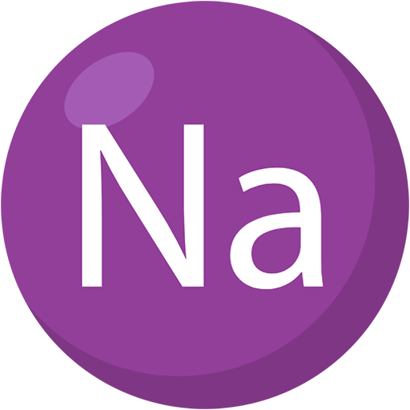

<p align="center">
  
</p>

<h1 align="center">LibSodium.Net</h1>
<p align="center">Modern Cryptography for .NET</p>

---

Welcome to **LibSodium.Net**, the secure and developer-friendly .NET bindings for [libsodium](https://libsodium.org) — a battle-tested, modern cryptographic library used around the world.

Whether you're building web services, desktop apps, IoT devices, or cross-platform tools, **LibSodium.Net** helps you add robust, efficient, and secure cryptographic functionality with confidence.

---

## ✨ Simple, Powerful, and Secure

- Built on the trusted [libsodium](https://libsodium.org) C library.
- Designed for modern .NET: efficient memory handling via `Span<T>`, support for AOT via `LibraryImport`.
- Safe-by-default APIs that help you do cryptography right.
- Includes secure memory utilities, symmetric and asymmetric encryption, hashing, key derivation, and more.

---

## 🌊 First-Class Streaming Encryption

LibSodium.Net provides idiomatic support for large file and streaming authenticated encryption using libsodium’s XChaCha20-Poly1305.

Powered by the `SecretStream `API, you can securely encrypt and decrypt files of any size with tamper-detection and zero nonce reuse risk — all in a few lines of code.

## 🚀 Get Started

Install the NuGet package:

```bash
dotnet add package LibSodium.Net
```

Then head over to our [Guide](./guide/index.md) to learn how to:

- Encrypt and decrypt data securely
- Generate cryptographic keys
- Work with secure memory
- Handle errors properly and safely

---

## 📄 Reference Documentation

Need details on specific APIs? Browse the full [Reference Documentation](./api/LibSodium.yml) to explore everything from `SecretBox` and `SecureMemory<T>` to stream encryption and key generation helpers.
